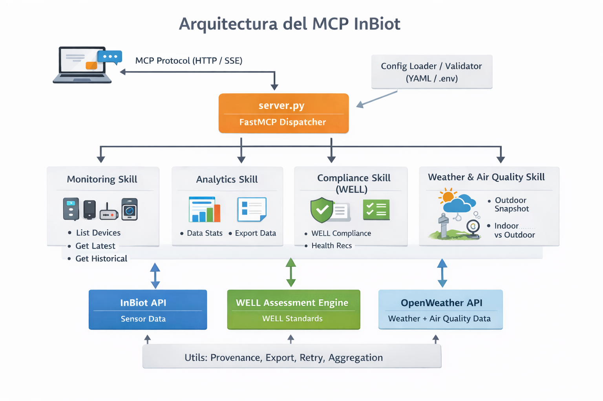

# InBiot MCP Server - Anne IAQ Expert

## ¿Por qué Anne?

Unifica datos de sensores, meteorología y estándares WELL/ASHRAE/WHO en un solo punto de acceso conversacional. Traduce números complejos en recomendaciones accionables y prioriza mejoras por ROI para certificación.



---

Anne es una **IA especializada en calidad del aire interior** para ayudar en análisis de IAQ y certificación WELL. Funciona como una consultora digital que puede:

- ✅ Analizar datos de MICAs en tiempo real
- ✅ Evaluar cumplimiento WELL v2 (Features A01-A08, T01-T07)
- ✅ Comparar condiciones interiores vs exteriores
- ✅ Generar recomendaciones de salud y confort
- ✅ Proponer roadmaps de certificación priorizados por ROI

> Evolución del CustomGPT original: [Anne V1.0 - AAQ & IAQ & WELL AP Consultant](https://chatgpt.com/g/g-68fbca77e29481918230000b31ec7c35-anne-aaq-iaq-well-ap-consultant)

## ¿Cómo funciona?

Anne tiene acceso a:
- 📊 **Datos en tiempo real** de sensores InBiot MICA
- 🌤️ **Meteorología y calidad del aire exterior** vía OpenWeather API
- 📚 **Documentación técnica** de WELL v2, ASHRAE 62.1/55 y WHO

Le puedes preguntar cosas como:
> *"¿Cómo está la calidad del aire en main_office?"*  
> *"¿Cumplimos WELL en el laboratorio? ¿Qué nos falta para Platinum?"*  
> *"Compara el aire interior con el exterior"*

---

## 🚀 Quick Start (Servidor Remoto)

La forma más fácil de usar Anne. Sin instalación, solo configura tu cliente MCP.

Añade esto a tu configuración MCP:

```json
"inbiot-Anne-IAQ-expert": {
  "command": "npx",
  "args": [
    "-y",
    "mcp-remote",
    "https://mcp.miguel-escribano.com/inbiot/sse",
    "--header",
    "X-MCP-Token: <TU_TOKEN>"
  ]
}
```

### Archivo de configuración según IDE

| IDE/App | Archivo de configuración |
|---------|--------------------------|
| **Cursor** | `%USERPROFILE%\.cursor\mcp.json` |
| **Claude Desktop** | `%APPDATA%\Claude\claude_desktop_config.json` |
| **VS Code** | `.vscode/mcp.json` en tu proyecto (o `Ctrl+Shift+P` → "MCP: Open User Configuration") |
| **Antigravity** | `%USERPROFILE%\.gemini\antigravity\mcp_config.json` (o Agent Panel → "..." → MCP Servers → View raw config) |

> **Requisitos:** [Node.js 18+](https://nodejs.org/). Contacta al administrador para obtener un token de acceso.

**Dispositivos disponibles:** `cafeteria`, `main_office`, `laboratory`, `miguel_demo`

💡 **Tip:** Con **Claude Desktop** puedes pedirle que genere **dashboards y visualizaciones a medida** con los datos de los sensores (gráficos de evolución, comparativas, informes PDF...).

---

## Herramientas Disponibles

### Monitoring
| Tool | Description |
|------|-------------|
| `list_devices` | Lista todos los dispositivos configurados |
| `get_all_devices_summary` | Dashboard de toda la instalación con indicadores (🟢🟡🔴⚫) |
| `get_latest_measurements` | Lecturas actuales de un dispositivo |
| `get_historical_data` | Mediciones históricas con estadísticas |

### WELL Compliance
| Tool | Description |
|------|-------------|
| `well_compliance_check` | Evaluación de cumplimiento WELL |
| `well_feature_compliance` | Desglose detallado A01-A08, T01-T07 |
| `well_certification_roadmap` | Camino priorizado a certificación con ranking ROI |
| `health_recommendations` | Recomendaciones de salud con targets específicos |

### Analytics
| Tool | Description |
|------|-------------|
| `detect_patterns` | Detecta patrones diarios/semanales de calidad del aire |
| `get_data_statistics` | Análisis estadístico con detección de tendencias |
| `export_historical_data` | Exporta a CSV/JSON con agregación temporal |

### Weather Context
| Tool | Description |
|------|-------------|
| `outdoor_snapshot` | Clima y calidad del aire exterior actual |
| `indoor_vs_outdoor` | Compara condiciones interiores vs exteriores |

---

## Ejemplos de Uso

```
# Vista rápida de toda la instalación
Dame un resumen de todos los dispositivos - ¿qué espacios necesitan atención?

# Cumplimiento WELL
Comprueba el cumplimiento WELL de main_office con recomendaciones

# Roadmap de certificación
¿Cuál es el camino más rápido a certificación Platinum para main_office?

# Análisis de patrones
Analiza los patrones de calidad del aire de main_office del último mes

# Recomendaciones de salud
Dame recomendaciones de salud para main_office con targets específicos

# Interior vs exterior
Compara la calidad del aire interior de main_office con el exterior
```

---

## 🔧 Instalación Local

<details>
<summary><strong>Click para expandir instrucciones de instalación local</strong></summary>

Para configurar tus propios dispositivos o modificar el comportamiento de Anne.

### Requisitos
- Python 3.10+
- Dispositivo(s) InBiot MICA con acceso API desde [My inBiot](https://my.inbiot.es)
- API key de OpenWeather (opcional) desde [OpenWeather](https://openweathermap.org/api)

### Instalación

```bash
git clone https://github.com/miguel-escribano/inBiot_MCP_with_WeatherAPI_and_WELL_standard.git
cd inBiot_MCP_with_WeatherAPI_and_WELL_standard

# Setup fácil (recomendado)
python setup.py

# O manual
pip install -e .
```

### Configuración

Crea `inbiot-config.yaml`:

```yaml
openweather_api_key: "tu-api-key"  # Opcional

devices:
  office:
    name: "Main Office"
    api_key: "xxxxxxxx-xxxx-xxxx-xxxx-xxxxxxxxxxxx"
    system_id: "xxxxxxxxxxxxxxxxxxxxxxxxxxxxxxxxxxxxxxxx"
    latitude: 40.416775
    longitude: -3.703790
```

> Obtén credenciales en [My inBiot Platform](https://my.inbiot.es) → Device Settings

### Configuración MCP (Local)

**Cursor IDE** - Añade a `~/.cursor/mcp.json`:

```json
{
  "mcpServers": {
    "inbiot-Anne-IAQ-expert": {
      "command": "python",
      "args": ["/RUTA/ABSOLUTA/A/server.py"]
    }
  }
}
```

**Claude Desktop** - Añade a `claude_desktop_config.json`:

```json
{
  "mcpServers": {
    "inbiot-Anne-IAQ-expert": {
      "command": "uvx",
      "args": ["--from", "/RUTA/ABSOLUTA/AL/repo", "inbiot-mcp-server"]
    }
  }
}
```

### Tests

```bash
pytest tests/ -v
```

### Estructura del Proyecto

```
├── server.py              # Servidor FastMCP principal
├── src/
│   ├── skills/            # Tools modulares (monitoring, analytics, compliance, weather)
│   ├── api/               # Clientes InBiot & OpenWeather
│   ├── well/              # Motor de compliance WELL
│   └── utils/             # Utilidades (agregación, export, retry)
├── resources/             # Recursos de documentación
└── tests/                 # Suite de tests
```

</details>

---

## Recursos Disponibles

| URI | Descripción |
|-----|-------------|
| `inbiot://docs/thresholds` | Umbrales unificados (WELL v2, ASHRAE, WHO) |
| `inbiot://docs/ashrae-iso` | Tabla de referencia ASHRAE 62.1/55, ISO 16000 |
| `inbiot://docs/parameters` | Guía de parámetros de calidad del aire |
| `inbiot://docs/well-standards` | Criterios WELL Building Standard |
| `inbiot://docs/iaq` | Guía del indicador IAQ de InBiot |
| `inbiot://docs/thermal-comfort` | Guía del indicador de confort térmico |
| `inbiot://docs/ventilation` | Guía del indicador de eficiencia de ventilación |
| `inbiot://docs/virus-resistance` | Guía del indicador de resistencia a virus |

---

## Info Adicional

### Rate Limits
- **InBiot API**: 6 requests por dispositivo por hora
- **OpenWeather API**: Según tier de suscripción
- Retry automático con backoff exponencial

### Niveles de Certificación WELL

| Nivel | Score |
|-------|-------|
| Platinum | 90%+ |
| Gold | 75%+ |
| Silver | 60%+ |
| Bronze | 40%+ |

---

## Links

- [InBiot](https://www.inbiot.es/) - Dispositivos de monitorización de calidad del aire
- [My inBiot Platform](https://my.inbiot.es) - Gestión de dispositivos
- [WELL Building Standard](https://www.wellcertified.com/) - Certificación de edificios
- [Model Context Protocol](https://modelcontextprotocol.io/) - Especificación MCP

## License

MIT
